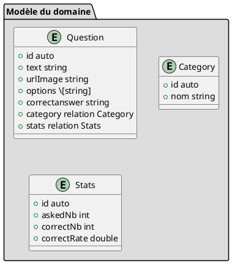

```plantuml
@startuml

package "Modèle du domaine" #DDDDDD {
    entity Question {
        + id auto
        + text string
	+ urlImage string
	+ options \[string]
	+ correctanswer string
	+ category relation Category
	+ stats relation Stats
    }

    entity Category {
        + id auto
        + nom string
    }

    entity Stats {
        + id auto
        + askedNb int
	+ correctNb int
	+ correctRate double
    }
}
@enduml
```

